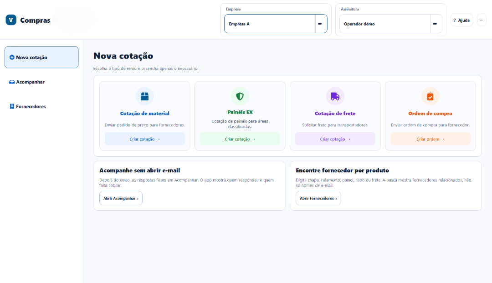
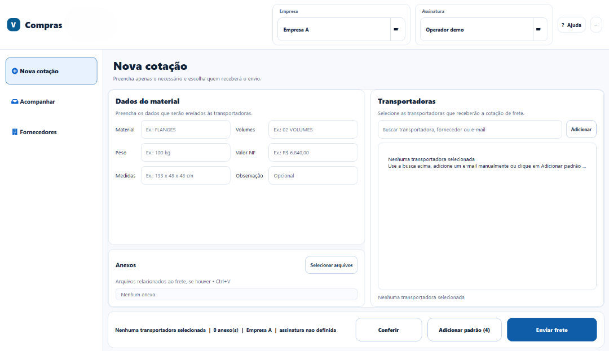
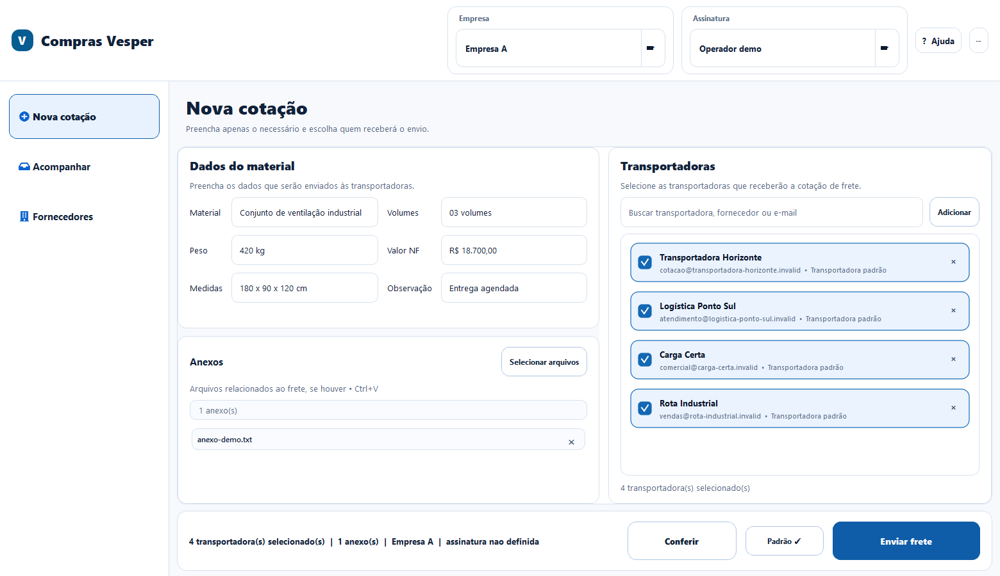
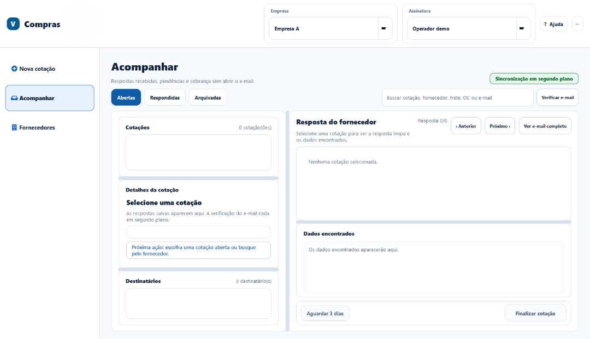

# ComprasVesper — cockpit desktop de cotações

Desenvolvi este aplicativo em **Python + PySide6** para organizar a etapa inicial de compras: localizar fornecedores, montar pedidos de cotação, enviar ordens de compra e acompanhar respostas sem depender de um processo manual espalhado entre planilhas e e-mails.

> Esta publicação é uma versão demonstrativa e reproduzível da aplicação 4.8.0. Catálogos, empresas, endereços, caixas de e-mail, assinaturas e caminhos corporativos foram substituídos por dados fictícios. No modo demo, envio SMTP, leitura IMAP e sincronização de rede ficam bloqueados.

## Problema que resolvi

Os dados de fornecedores ficavam em planilhas, enquanto pedidos de cotação, anexos e acompanhamento de respostas ficavam distribuídos entre e-mails e mensagens. Isso aumentava o tempo para localizar contatos e dificultava saber quem havia respondido.

O aplicativo reúne esse fluxo em uma única interface:

```text
Base XLSX de fornecedores
        ↓
Busca por produto, empresa, contato ou e-mail
        ↓
Material · Painéis EX · Frete · Ordem de compra
        ↓
Revisão humana de destinatários, texto e anexos
        ↓
SMTP configurado pela organização
        ↓
Histórico + acompanhamento IMAP de respostas + próxima ação
```

## Uso atual

A versão interna é utilizada por **três pessoas** sempre que existe necessidade de cotação com fornecedores. A edição pública mantém a interface, a arquitetura e as principais regras, mas usa fornecedores e dados fictícios.

## Interface

### Escolha do fluxo



### Cotação de frete



### Cotação preenchida

A tela abaixo foi gerada pela própria aplicação depois de preencher os dados da carga, anexar um arquivo fictício e selecionar transportadoras.



### Acompanhamento de respostas



## Fluxos principais

| Fluxo | O que acontece |
| --- | --- |
| **Nova cotação** | A pessoa escolhe material, painéis EX, frete ou ordem de compra e recebe campos específicos para a tarefa. |
| **Busca de destinatários** | A pesquisa tolera pequenos erros de digitação e usa empresa, contato, e-mail e produto para encontrar opções. |
| **Frete** | Transportadoras padrão e fornecedores da base podem ser combinados em uma seleção visual. |
| **Acompanhar** | Respostas IMAP são correlacionadas com a referência da cotação; a tela mostra resposta, dados comerciais e pendências. |
| **Histórico** | Envios e ações ficam disponíveis para consulta e exportação XLSX. |

## Decisões técnicas

- **Revisão humana antes do envio:** a aplicação mostra e valida destinatários, corpo e anexos antes de qualquer saída.
- **Fila local durável:** falhas de SMTP entram em SQLite com WAL, recuperação de itens presos, backoff progressivo e chave de idempotência persistida.
- **Reenvio tratado como best effort:** SMTP não oferece confirmação transacional ponta a ponta; por isso, o sistema mantém a auditoria visível.
- **Segredos locais:** configuração compartilhada contém apenas metadados; senhas e chaves ficam protegidas por DPAPI em cada estação.
- **Planilha como entrada, não como interface principal:** XLSX continua familiar, enquanto índice local, busca e validações retiram o trabalho manual da planilha.

## Arquitetura

| Camada | Papel |
| --- | --- |
| [`app/qt`](app/qt) | Shell desktop, navegação, tema, componentes e páginas operacionais. |
| [`app/application`](app/application) | Contexto, casos de uso, jobs e inicialização. |
| [`app/catalog`](app/catalog) | Índice, normalização e busca de fornecedores. |
| [`app/core`](app/core) | E-mail, IMAP, tracking, histórico, arquivos, configuração e regras de negócio. |
| [`tests`](tests) | Contratos de interface, busca, tracking e modo demonstração. |
| [`installer`](installer) | Empacotamento Windows via Inno Setup. |

Documentos técnicos: [arquitetura](docs/architecture.md), [segurança](docs/security.md) e [testes](docs/testing.md).

## Executar a demonstração

Pré-requisitos: Windows e Python 3.12+ ou `uv`.

```powershell
uv venv .venv --python 3.12
uv pip install -r requirements-dev.txt --python .venv\Scripts\python.exe

$env:COMPRAS_VESPER_DEMO = "1"
$env:APPDATA = "$PWD\.demo-runtime"
.\.venv\Scripts\python.exe -m app.main
```

O catálogo usado pela demonstração é [`examples/fornecedores-demo.xlsx`](examples/fornecedores-demo.xlsx). Ele utiliza o domínio `.invalid`, reservado para exemplos e incapaz de encaminhar e-mails reais.

## Testes

```powershell
$env:COMPRAS_VESPER_DEMO = "1"
$env:APPDATA = "$PWD\.demo-runtime"
$env:QT_QPA_PLATFORM = "offscreen"
.\.venv\Scripts\python.exe -m compileall -q app
.\.venv\Scripts\python.exe -m pytest -q
.\.venv\Scripts\python.exe -m app.tools.smoke_core
```

Na revisão da versão pública foram executados **48 testes**, além da compilação dos módulos e do smoke do núcleo. O GitHub Actions repete a checagem em Windows.

## Estado e limites

- não há credenciais, dados de clientes, fornecedores reais ou caminhos de NAS no repositório;
- o modo demonstração bloqueia SMTP, IMAP e sincronização de rede por código;
- uma implantação real precisa configurar contas, diretório de dados, backup e controle de acesso próprios.

## Autor

**Maycon Ferreira** — produto, automação de processos, interface desktop e integração de sistemas para compras.
